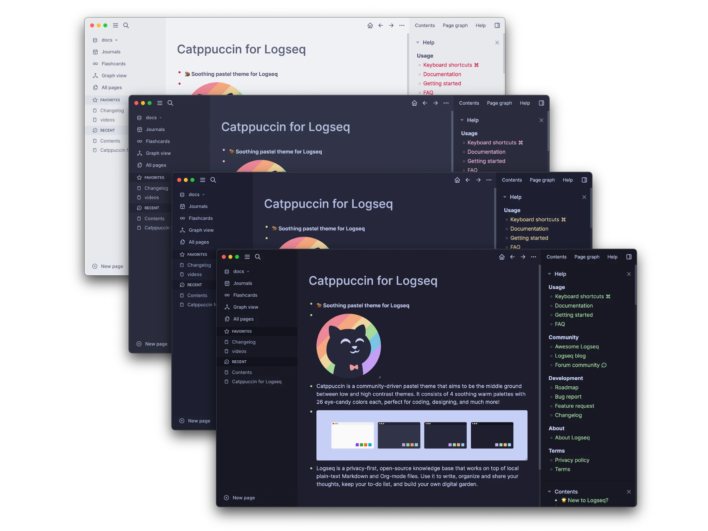
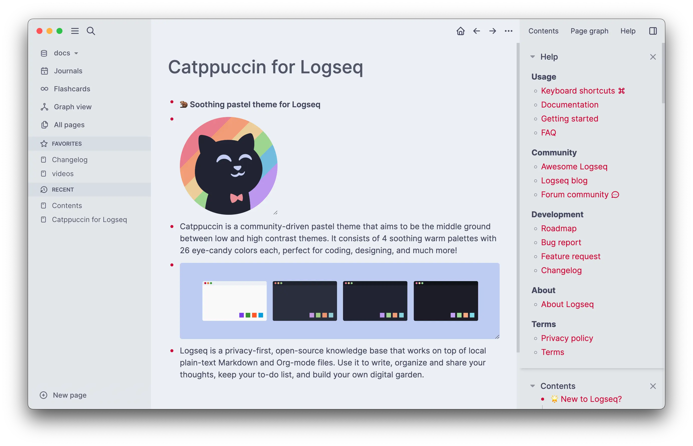
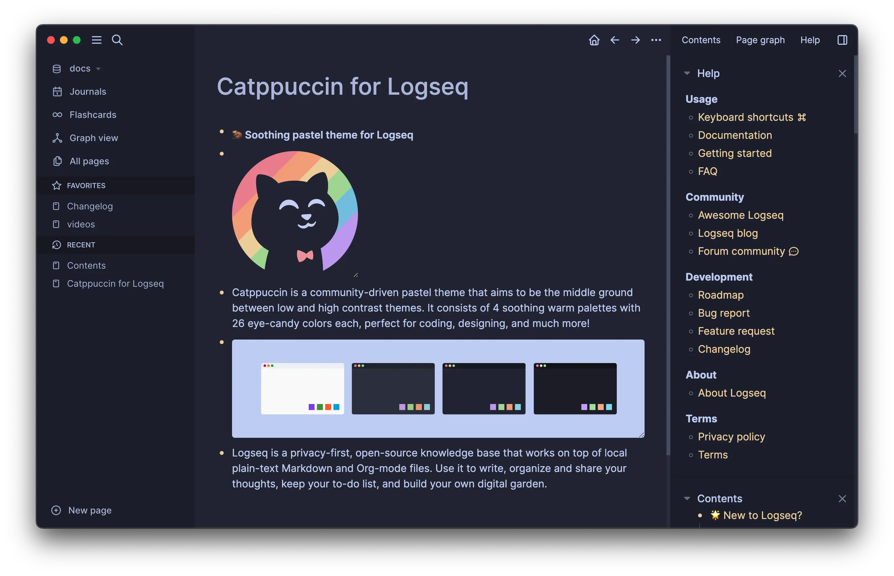

<h3 align="center">
	 
	
	Catppuccin for <a href="https://logseq.com/">Logseq</a>
	
</h3>

	
	
	

	

## Previews

🌻 Latte

🪴 Frappé

🌺 Macchiato

🌿 Mocha

## Usage

### Installation

1. Logseq Plugin Marketplace (Soon TBD)
2. Add manually from GitHub Releases
    1. Download `.zip` from latest release.
    2. Extract it to desired location.
    3. Enable `Developer Mode` under `Settings` > `Advanced`.
    4. Use the new `Load unpacked plugin` option under `Plugins`, choosing extracted folder to install the theme.
4. Clone Repository and add manually
    1. Clone repository (including submodules)
    2. Run `npm ci && npm run build`
    3. Enable `Developer Mode` under `Settings` > `Advanced`
    4. Use the new `Load unpacked plugin` option under `Plugins`, choosing repo folder to install the theme.

### Switching Accent Color

1. Theme settings can be accessed under `Settings` > `Plugins` > `Catppuccin`
2. Select an accent color of choice from the dropdown under `CtpAccent` setting.

Screenshot

## 💝 Thanks to

**Current Maintainer(s)**
- [griimick](https://github.com/griimick)

**Inspiration and Contribution**
- [pengx17](https://github.com/pengx17) for [logseq-dev-theme](https://github.com/pengx17/logseq-dev-theme)

&nbsp;

	

	Copyright &copy; 2023-present <a href="https://github.com/catppuccin" target="_blank">Catppuccin Org</a>

	

